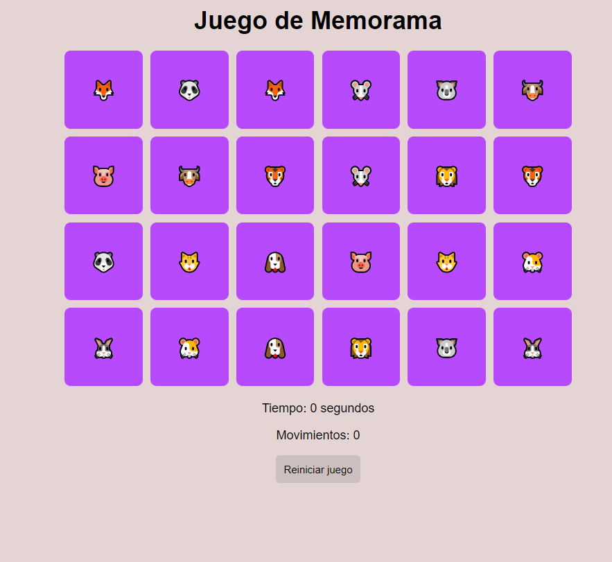
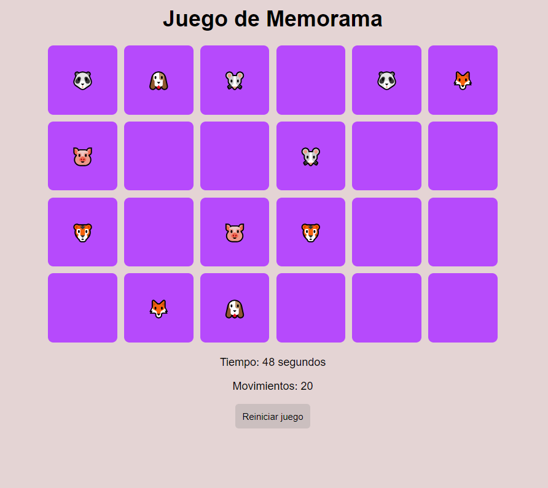
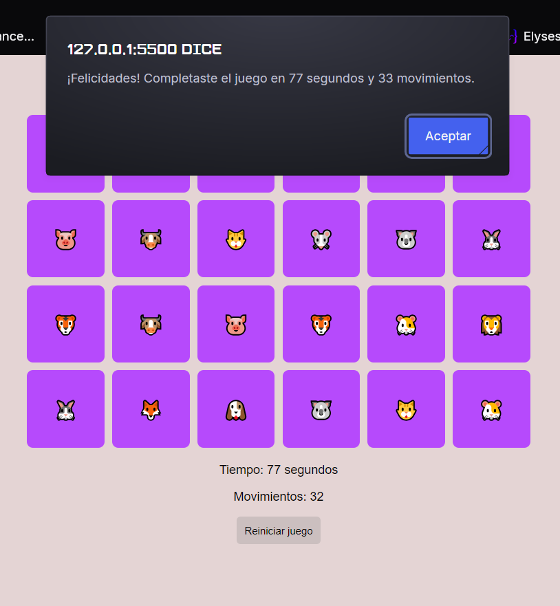

# Juego de Memorama 🃏

## Descripción
El **Juego de Memorama** es un proyecto desarrollado con HTML, CSS y JavaScript. El objetivo es encontrar todas las parejas de cartas en el menor tiempo y movimientos posibles. Este proyecto resalta la manipulación del DOM y la lógica interactiva en un entorno visual.

## Características
- **Cartas dinámicas**: Las cartas se generan aleatoriamente en cada partida.
- **Temporizador**: Mide el tiempo transcurrido para completar el juego.
- **Contador de movimientos**: Registra los intentos realizados.
- **Reinicio rápido**: Botón para reiniciar la partida en cualquier momento.
- **Ayuda visual inicial**: Todas las cartas se muestran brevemente al inicio para memorizarlas.

## Tecnologías utilizadas
- **HTML**: Estructura del juego.
- **CSS**: Estilos responsivos y animaciones.
- **JavaScript**: Lógica del juego y manipulación del DOM.

## Capturas de pantalla
### Vista inicial del juego

### Durante el juego

### Juego completado

